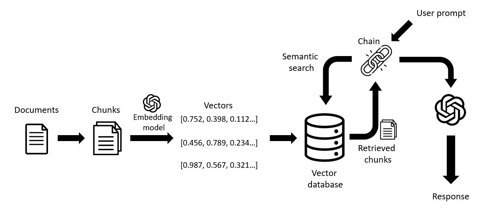

# Financial QA Bot using LangChain and OpenAI 
 
 

This project implements FinQA using OpenAI's embedding models and LangChain's Python library. The goal is to create a user-friendly Financial QA application capable of ingesting data from multiple sources, including Word, PDF, TXT, and JSON formats

## Problem Statement

The vast quantity of financial statements presents significant challenges for human analysts seeking to access and evaluate a business's financial status. Similarly, robust numerical reasoning encounters unique hurdles within this domain. This work aims to address these challenges by focusing on answering in-depth questions concerning financial data, with the goal of automating the analysis of extensive corpuses of financial documents. Unlike tasks in the general domain, financial analysis involves complex numerical reasoning and requires an understanding of heterogeneous representations. To facilitate analytical progress, we introduce FinQA, a new large-scale dataset featuring Question-Answering pairs over Financial reports, curated by financial experts.

## Dataset Used

- As per recommended, we used the dataset from this link
  https://github.com/czyssrs/finqa
- Data is present in below format
  - "pre_text": the texts before the table;
  - "post_text": the text after the table;
  - "table": the table;
  - "id": unique example id. composed by the original report name plus example index for this report.
  - "qa": {
    "question": the question;
     "program": the reasoning program;
     "gold_inds": the gold supporting facts;
     "exe_ans": the gold execution result;
     "program_re": the reasoning program in nested format;
  }

## Process
- Upload the json files downloaded from the dataset. Due to open ai token limitation or constraint we read only 100 rows for now.
- When the data is uploaded the data is cleaned. We remove all the unnecessary characters and fields before creating embeddings.
- Ask Question in the UI

## Domain areas include:
- Document splitting
- Embeddings (OpenAI)
- Vector database (Chroma / FAISS)
- Semantic search types
- Retrieval chain

## Future work:
- Capability to create embeddings for any amount of data 
- Introduce conversation retriever and memory states
- Fine-tuning model on the FinQA dataset

## Step to follow in order to build this application from scratch:
1. Create devfinqa venv using below cmd:
    py -m pip install --user virtualenv
    py -m virtualenv devfinqa
    source dev/bin/activate (=> to activate)
    pip install -r requirements.txt (attached file)

2. Run "Python app.py"

3. Run "streamlit run app.py"

